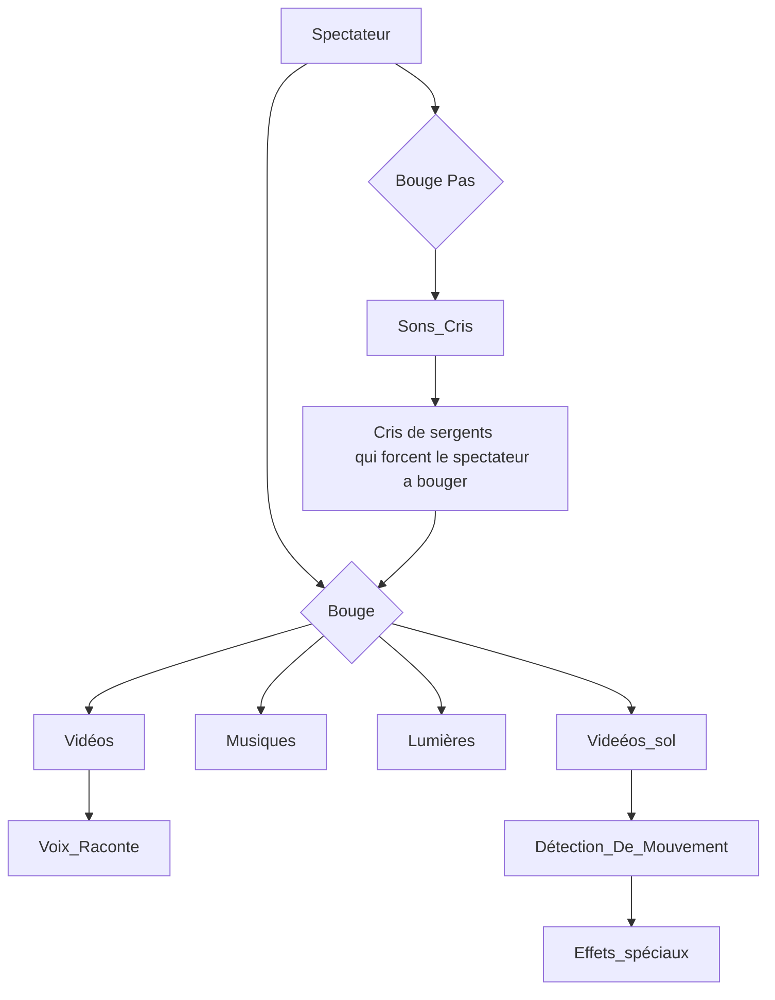

# Civilisation Perdue

## Idée 
Un simulateur qui transporte les participants dans des paysages du passé en utilisant des archives sonores et visuelles.

## Concept 
Le participant est placé dans une salle immersive où des paysages romains anciens, qui ont depuis longtemps disparu ou changé, sont recréés grâce à des archives historiques. Cela peut inclure des monuments qui ont été détruits, des sculptures détruites ou des écosystèmes dégradés par le temps. Les sons captés à ces époques sont diffusés pour compléter l'expérience. L’environnement recréé en temps réel permet au visiteur de « marcher » à travers ces paysages perdus, d’entendre des sons et de découvrir ce qui a été effacé à cause tu temps.

## Objectifs
Revisiter l’histoire ancienne en offrant une nouvelle perspective sur le patrimoine romain perdu, sensibiliser à la préservation du patrimoine historique, et créer un lien émotionnel avec le passé à travers une expérience éducative interactive et immersive. La (re)découverte des figures historiques de cette époque ainsi que leur mode de vie sera mis en avant ce qui va permettre aux participants de mieux comprendre l’impact de la culture romaine sur notre monde contemporain.

## Ambiance
### Visuelle

### Sonore
Une bande sonore immersive qui contient un mélange de murmures de foule, de bruits de la nature et de musiques romaines. Des éléments sonores, comme le son d’un marteau sur la pierre ou des chants lointains ou bine des sons d'épées qui s'entrechoquent seront joués dépendament des scènes.

[Épée](/media/sons/bruits_epee.mp3)
[Charette](/media/sons/charette_cheval.mp3)
[Forge](/media/sons/forge.mp3)

### Graphique

### Inspirations
Une grande inspiration des Films/séries comme _Spartacus_, _Gladiator_ ou bien encore _Rome_ qui montrent et explique le mode de vie des romains à leur époque. Les trames sonores et la reconstruction des différents décores romains nous plongent dans leur univers.

## Objets techniques
  - Caméras
  - Produits audio
  - Projecteurs
  - Casques de réalité virtuelle
  - Écrans
  - Capteurs de mouvement
  - Systèmes de son

## Outils
  - Logiciels graphiques : Photoshop - Illustrator 
  - Logiciels 3D : Blender - Maya
  - Logiciels de montage vidéo : DaVinci - Premier Pro
  - Logiciels Web : HTML5 - CSS - JavaScript
  - Logiciels interactifs : Unity - TouchDesigner
  - Logiciels sonore : Max - Logic Pro
  - Logiciels de réalité augmentée et virtuelle : Unreal Engine - ARKit
  - Outils de prototypage : Figma 
  - Logiciels de gestion de projet : Trello
