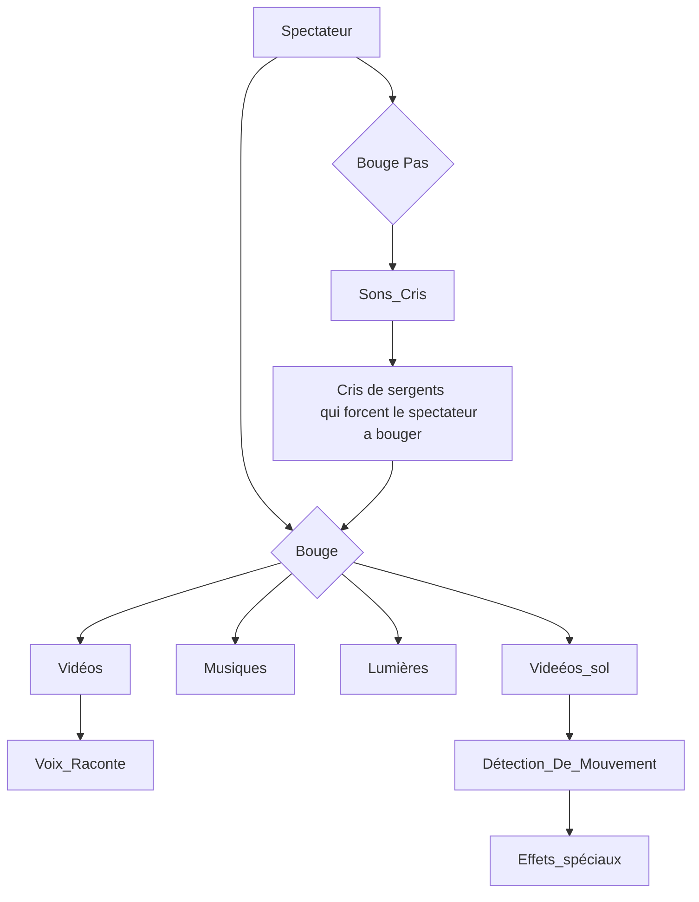
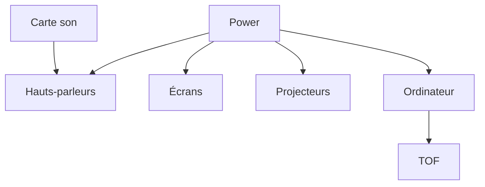

# Civilisation Perdue

## Idée 
Un simulateur qui transporte les participants dans des paysages du passé en utilisant des archives sonores et visuelles.

## Concept 
Le participant est placé dans une salle immersive où des paysages romains anciens, qui ont depuis longtemps disparu ou changé, sont recréés grâce à des archives historiques. Cela peut inclure des monuments qui ont été détruits, des sculptures détruites ou des écosystèmes dégradés par le temps. Les sons captés à ces époques sont diffusés pour compléter l'expérience. L’environnement recréé en temps réel permet au visiteur de « marcher » à travers ces paysages perdus, d’entendre des sons et de découvrir ce qui a été effacé à cause tu temps.

## Objectifs
Revisiter l’histoire ancienne en offrant une nouvelle perspective sur le patrimoine romain perdu, sensibiliser à la préservation du patrimoine historique, et créer un lien émotionnel avec le passé à travers une expérience éducative interactive et immersive. La (re)découverte des figures historiques de cette époque ainsi que leur mode de vie sera mis en avant ce qui va permettre aux participants de mieux comprendre l’impact de la culture romaine sur notre monde contemporain.

## Ambiance
### Visuelle

### Sonore
Une bande sonore immersive qui contient un mélange de murmures de foule, de bruits de la nature et de musiques romaines. Des éléments sonores, comme le son d’un marteau sur la pierre ou des chants lointains ou bine des sons d'épées qui s'entrechoquent seront joués dépendament des scènes.

[Épée](/media/sons/bruits_epee.mp3)
[Charette](/media/sons/charette_cheval.mp3)
[Forge](/media/sons/forge.mp3)
[Bouge](/media/sons/Move.mp3)

### Graphique

### Inspirations
Une grande inspiration des Films/séries comme _Spartacus_, _Gladiator_ ou bien encore _Rome_ qui montrent et explique le mode de vie des romains à leur époque. Les trames sonores et la reconstruction des différents décores romains nous plongent dans leur univers.

## Objets techniques
  - Caméras
  - Produits audio
  - Projecteurs
  - Casques de réalité virtuelle
  - Écrans
  - Capteurs de mouvement
  - Systèmes de son

## Outils
  - Logiciels graphiques : Photoshop - Illustrator 
  - Logiciels 3D : Blender - Maya
  - Logiciels de montage vidéo : DaVinci - Premier Pro
  - Logiciels Web : HTML5 - CSS - JavaScript
  - Logiciels interactifs : Unity - TouchDesigner
  - Logiciels sonore : Max - Logic Pro
  - Logiciels de réalité augmentée et virtuelle : Unreal Engine - ARKit
  - Outils de prototypage : Figma 
  - Logiciels de gestion de projet : Trello
----------------------------------------------------------------------------------------------------------------------------------------------------------------------------
---- ## Scénarimage

| Catégorie                     | Détails                                                                                              | Nombre |
|-------------------------------|------------------------------------------------------------------------------------------------------|--------|
| **Matériel Audiovisuel**      |                                                                                                      |        |
| Projecteurs                   | Résolution : 1920x1080 (Full HD)   Luminosité : Minimum 3000 lumens   Type : DLP ou LCD      | 3      |
| Système audio                 | Haut-parleurs : 2x 100W   Carte son : Compatible USB ou PCI   Logiciel de mixage | 2x haut-parleurs, 1 carte son |
| **Capteurs et Interactions**   |                                                                                                      |        |
| Capteurs de mouvement (TOF)   | Plage : 0,2 m à 4 m   Temps de réponse : < 100 ms                                               | 6      |
| Plateformes de détection      | Sensibilité : Détection de pression légère (1 kg ou moins)   Dimensions personnalisables         | 4      |
| **Éclairage**                 | Spots LED avec variation d’intensité   Contrôle DMX   Éclairage d’ambiance                   | 5      |
| **Contraintes Budgétaires**   | Budget limité, recherche de partenariats ou sponsors                                               | -      |
| **Contraintes de Temps**      | Délais serrés, nécessité de coordination entre équipes                                               | -      |
| **Contraintes d’Espace**      | Limitations physiques pour l’installation, optimisation de l’espace pour la circulation               | -      |
| **Contraintes Techniques**     | Compatibilité des équipements et logiciels   Fonctionnement fluide des capteurs                   | -      |
| **Contraintes de Sécurité**   | Sécurisation des équipements, protection des données personnelles                                   | -      |

---- ## Performances techniques en fonction des exigences du projet

## Étapes de Réalisation

1. **Conception et Planification** (Durée : 2 mois)
   - Élaboration du Concept : Définir les thèmes et les contenus à présenter.
   - Recherche Historique : Collecter des données sur les paysages et les monuments romains disparus.
   - Création du Scénario : Établir le parcours de l'exposition et les interactions prévues.

2. **Développement Technique** (Durée : 3 mois)
   - Développement Logiciel : Programmer les interactions, les animations et les éléments audio/visuels.
   - Intégration des Matériaux : Assembler les éléments audio, vidéo et graphiques dans l'environnement numérique.
   - Tests Techniques : Effectuer des tests de performance et de compatibilité pour s'assurer que tout fonctionne correctement.

3. **Installation et Configuration** (Durée : 1 mois)
   - Installation du Matériel : Installer les projecteurs, le système audio, les capteurs de mouvement, et l'éclairage.
   - Configuration des Systèmes : Réglages techniques pour garantir la synchronisation audio-visuelle et l'interactivité.
   - Tests de l’Exposition : Réaliser des tests finaux avec des utilisateurs pour s'assurer que l'expérience est fluide et engageante.

4. **Formation du Personnel** (Durée : 2 semaines)
   - Formation Technique : Former le personnel sur l'utilisation du matériel et des logiciels.
   - Préparation à l’Accueil du Public : Informer le personnel sur la gestion des visiteurs et des aspects logistiques.

5. **Lancement de l’Exposition** (Durée : 1 semaine)
   - Vérifications Finales : S'assurer que tous les éléments fonctionnent parfaitement avant l'ouverture.
   - Événement d'Inauguration : Organiser un événement pour le lancement de l'exposition.

## Organigramme de la programmation

| Métier                | Nombre | Responsabilité                                                                                  |
|----------------------|--------|------------------------------------------------------------------------------------------------|
| Technicien·ne en son | 1x     | Installation et gestion du matériel audio, création et mixage de la bande sonore immersive, réglage des niveaux audio pendant l'exposition. |
| Intégrateur·rice     | 1x     | Intégration des éléments graphiques, audio et interactifs, création de l'expérience immersive. |
| Programmeur·euse     | 1x     | Développement de la logique interactive de l'exposition et gestion des interactivités.        |
| Concepteur·rice      | 1x     | Création du concept visuel et sonore, design des éléments interactifs et de la narration.      |
| Développeur·euse     | 1x     | Développement du logiciel d'interaction et intégration avec les capteurs et le matériel.      |

---- ## Numérotation des séquences et médias associés
---- ## Inventaire des médias prévus au scénario et au scénarimage
---- ## Stratégie de montage

